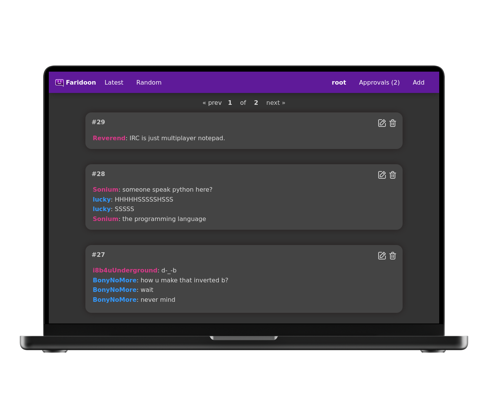
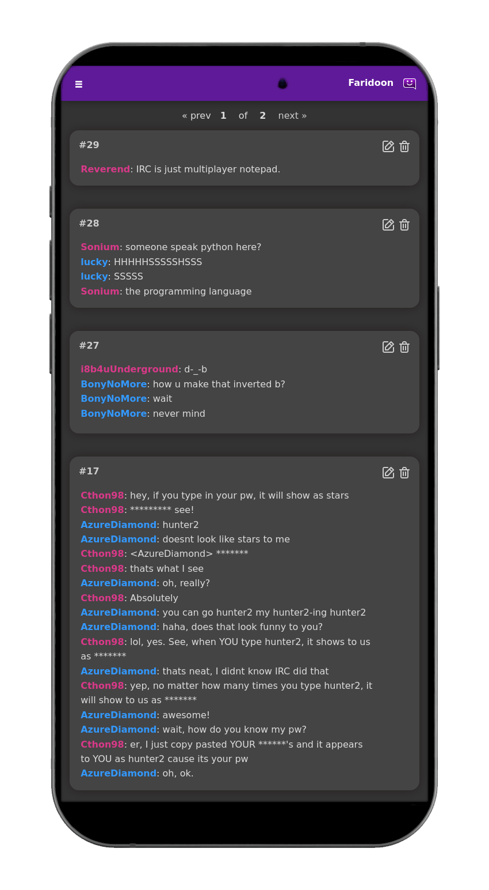

  
  <h1>Faridoon</h1>

  Easily save and publish your favourite chat quotes for others to see.

 

## Screenshots 

Note the screenshots below contain quotes from the site that inspired this self hosted project - bash.org - which is now offline. There are several mirrors available via search engines. These quotes were used because they've been shared wildly for over 2 decades, and they're pretty funny :-) 

## Getting Started

Documentation is available at: https://jamesread.github.io/faridoon/ , the recommended installation method is via **Docker**, connected to a **MySQL Database**. Faridoon runs just fine with low system resources - 1 vCPU and a 1 GB of RAM is plenty. 

## Features

* Automatic highlighting of usernames.
* Semi-intelligent removal of line breaks and weird characters.
* User login and registration, with support for admins and non-admins.
* Approval system for guest and non-admin submissions.
* Easy configuration via environment variables, or configuration file.

## **Faridoon is a No-Nonsense Open Source project;**

- All code and assets are Open Source (AGPL).
- No company is paying for development, there is no paid-for support from the developers.
- No separate core and premium version, no plus/pro version or paid-for extra features.
- No SaaS service or "special cloud version".
- No "anonymous data collection", usage tracking, user tracking, telemetry or email address collection.
- No requests for reviews in any "app store" or feedback surveys.
- No prompts to "upgrade to the latest version".
- No internet-connection required for any functionality.

